# Risques

``` r
library(InsurFair)
library(randomForest)
```

    randomForest 4.7-1.1

    Type rfNews() to see new features/changes/bug fixes.

``` r
data(frenchmotor)
data(COLORS)
```

# logistic

``` r
RF = randomForest(y~. ,data=frenchmotor)
varImpPlot(RF , sort = TRUE) -> vi
```

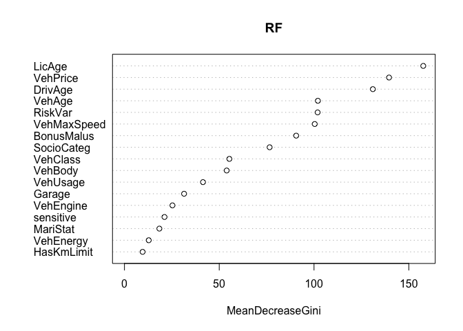

``` r
dfvi = data.frame(nom = names(frenchmotor)[-16], g = as.numeric(vi))
dfvi = dfvi[rev(order(dfvi$g)),]
nom = dfvi$nom
nom[1] = "bs(LicAge)"
nom[3] = "bs(DrivAge)"
nom[7] = "bs(BonusMalus)"


n=nrow(frenchmotor)
library(splines)

metricbs= function(k =3){
  sortie=c(0,0,1,1,1,1,1,1,0,1)
  if(k>0){
vr = paste(nom[1:k],collapse = " + ")
fm = paste("y ~ ",vr,sep="")
reg = glm(fm, family=binomial, data=frenchmotor)
yp = predict(reg, type="response")
v1 = var(yp)
idx9 = which(yp>quantile(yp,.9))
idx1 = which(yp<quantile(yp,.1))
v2 = var(yp[idx9])
m1 = mean(yp[idx9])/mean(yp)
m2 = mean(yp[idx9])/mean(yp[idx1])
q1 = quantile(yp,.9)-quantile(yp,.1)
q2 = quantile(yp,.9)/quantile(yp,.1)
q3 = quantile(yp,.9)/mean(yp)
q4 = quantile(yp,.99)/mean(yp)
z = mean(yp>2*mean(yp))
idx95 = which(yp>quantile(yp,.95))
idx05 = which(yp<quantile(yp,.05))
sortie = c(v1,v2,m1,m2,q1,q2,q3,q4,z, mean(yp[idx95])/mean(yp[idx05]))
  }
  sortie}

metric= function(k =3){
  sortie=c(0,0,1,1,1,1,1,1,0,1)
  if(k>0){
vr = paste(dfvi$nom[1:k],collapse = " + ")
fm = paste("y ~ ",vr,sep="")
reg = glm(fm, family=binomial, data=frenchmotor)
yp = predict(reg, type="response")
v1 = var(yp)
idx9 = which(yp>quantile(yp,.9))
idx1 = which(yp<quantile(yp,.1))
idx95 = which(yp>quantile(yp,.95))
idx05 = which(yp<quantile(yp,.05))
v2 = var(yp[idx9])
m1 = mean(yp[idx9])/mean(yp)
m2 = mean(yp[idx9])/mean(yp[idx1])
q1 = quantile(yp,.9)-quantile(yp,.1)
q2 = quantile(yp,.9)/quantile(yp,.1)
q3 = quantile(yp,.9)/mean(yp)
q4 = quantile(yp,.99)/mean(yp)
z = mean(yp>2*mean(yp))
sortie = c(v1,v2,m1,m2,q1,q2,q3,q4,z,mean(yp[idx95])/mean(yp[idx05]))
  }
  sortie}

N = 0:16
M0 =Vectorize(metric)(N)
M =Vectorize(metricbs)(N)
```

``` r
plot(N,M[1,],xlab="Nombre de variables explicatives",ylab=
       "Variance des scores",type="b",pch=19,col=COLORS[2])
```

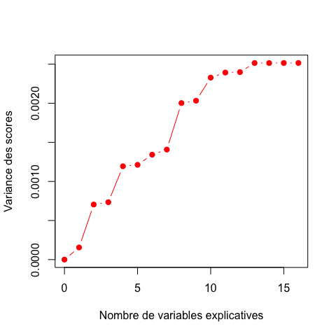

``` r
plot(N,M[1,],xlab="Nombre de variables explicatives",ylab=
       "Variance des scores",type="b",pch=19)

plot(N,M[1,],xlab="Nombre de variables explicatives",ylab=
       "Variance des scores",type="b",pch=19)
lines(N,M0[1,],type="b",pch=15, col=scales::alpha("grey",.6))
```

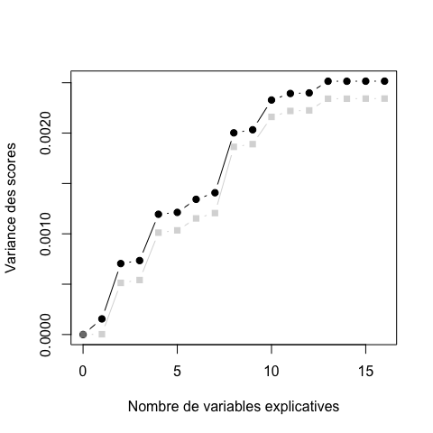

``` r
plot(N,M[1,],xlab="Nombre de variables explicatives",ylab=
       "Variance des scores",type="b",pch=19)
lines(N,M0[1,],type="b",pch=15, col=scales::alpha("grey",.6))
abline(v=(0:3)*5,col=scales::alpha("light blue",.4))
abline(h=(0:5)/5*.0025,col=scales::alpha("light blue",.4))
```

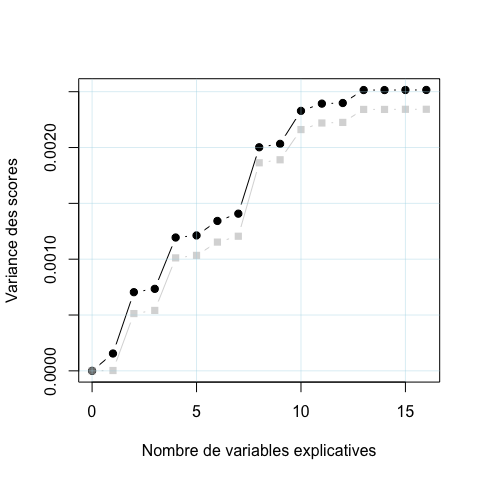

``` r
plot(N,M[1,],xlab="Nombre de variables explicatives",ylab=
       "Variance des scores",type="b",pch=19)
lines(N,M0[1,],type="b",pch=15, col=scales::alpha("grey",.8))
abline(v=(0:3)*5,col=scales::alpha("light blue",.4))
abline(h=(0:5)/5*.0025,col=scales::alpha("light blue",.4))
```

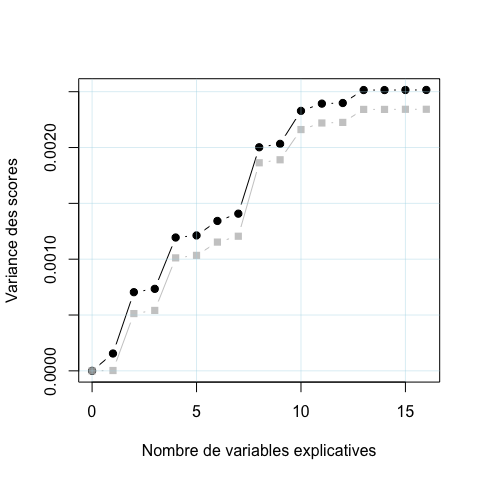

``` r
# plot(N,M[3,],xlab="Nombre de variables explicatives",ylab=
#        "Espérance du top 10% / Espérance globale",type="b",pch=19,col=COLORS[2])
```

``` r
plot(N,M[4,],xlab="Nombre de variables explicatives",ylab=
       "Ratio des espérances du décile 90% / 10%",type="b",pch=19,col=COLORS[2])
```

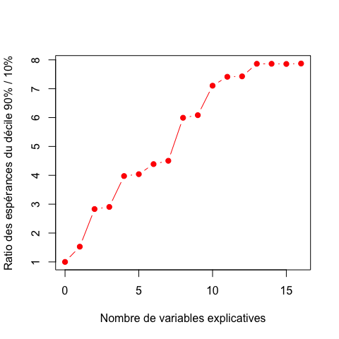

``` r
plot(N,M[4,],xlab="Nombre de variables explicatives",ylab=
       "Ratio des espérances du décile 90% / 10%",type="b",pch=19)

plot(N,M[4,],xlab="Nombre de variables explicatives",ylab=
       "Ratio des espérances du décile 90% / 10%",type="b",pch=19)
lines(N,M0[4,],type="b",pch=15, col=scales::alpha("grey",.6))
```


``` r
plot(N,M[4,],xlab="Nombre de variables explicatives",ylab=
       "Ratio des espérances du décile 90% / 10%",type="b",pch=19)
lines(N,M0[4,],type="b",pch=15, col=scales::alpha("grey",.6))
abline(v=(0:3)*5,col=scales::alpha("light blue",.4))
abline(h=(0:8),col=scales::alpha("light blue",.4))
```

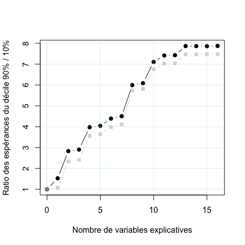

``` r
plot(N,M[4,],xlab="Nombre de variables explicatives",ylab=
       "Ratio des espérances du décile 90% / 10%",type="b",pch=19)
lines(N,M0[4,],type="b",pch=15, col=scales::alpha("grey",.8))
abline(v=(0:3)*5,col=scales::alpha("light blue",.4))
abline(h=(0:8),col=scales::alpha("light blue",.4))
```

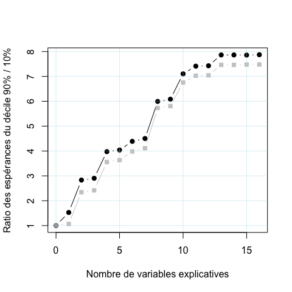

``` r
plot(N,M[6,],xlab="Nombre de variables explicatives",ylab=
       "Ratio des quantiles 90% / 10%",type="b",pch=19,col=COLORS[2])
```

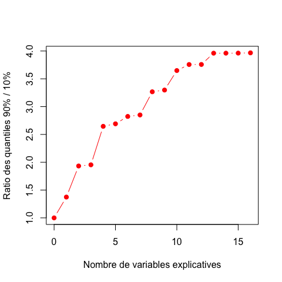

``` r
plot(N,M[6,],xlab="Nombre de variables explicatives",ylab=
       "Ratio des quantiles 90% / 10%",type="b",pch=19)

plot(N,M[6,],xlab="Nombre de variables explicatives",ylab=
       "Ratio des quantiles 90% / 10%",type="b",pch=19)
lines(N,M0[6,],type="b",pch=15, col=scales::alpha("grey",.6))
```

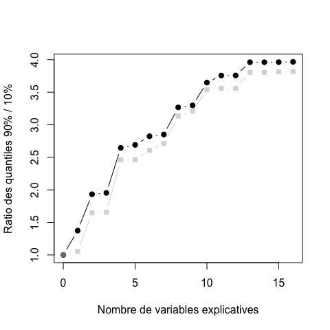

``` r
plot(N,M[6,],xlab="Nombre de variables explicatives",ylab=
       "Ratio des quantiles 90% / 10%",type="b",pch=19)
lines(N,M0[6,],type="b",pch=15, col=scales::alpha("grey",.6))
abline(v=(0:3)*5,col=scales::alpha("light blue",.4))
abline(h=(0:8)/2,col=scales::alpha("light blue",.4))
```


``` r
plot(N,M[6,],xlab="Nombre de variables explicatives",ylab=
       "Ratio des quantiles 90% / 10%",type="b",pch=19)
lines(N,M0[6,],type="b",pch=15, col=scales::alpha("grey",.8))
abline(v=(0:3)*5,col=scales::alpha("light blue",.4))
abline(h=(0:8)/2,col=scales::alpha("light blue",.4))
```


``` r
# plot(N,M[5,],xlab="Nombre de variables explicatives",ylab=
#        "Différence Q90%-Q10%",type="b",pch=19,col=COLORS[4])
library(kdensity)
# plot(N,M[6,],xlab="Nombre de variables explicatives",ylab=
#        "Ratio du quantile 90% / 10%",type="b",pch=19,col=COLORS[4])
# plot(N,M[8,],xlab="Nombre de variables explicatives",ylab=
#        "Ratio Q99% / moyenne",type="b",pch=19,col=COLORS[4])
plot(N,M[9,],xlab="Nombre de variables explicatives",ylab=
       "Proba >17%",type="b",pch=19,col=COLORS[2])
```

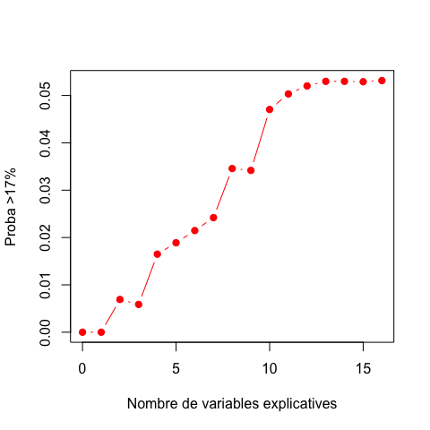

``` r
k=2
vr = paste(nom[1:k],collapse = " + ")
fm = paste("y ~ ",vr,sep="")
reg = glm(fm, family=binomial, data=frenchmotor)
yp = predict(reg, type="response")
mean(yp>.17)
```

    [1] 0.008683766

``` r
yp = sample(yp,size=5000)
d3 = kdensity::kdensity(yp, kernel = "beta",bw=.005)

k=7
vr = paste(nom[1:k],collapse = " + ")
fm = paste("y ~ ",vr,sep="")
reg = glm(fm, family=binomial, data=frenchmotor)
yp = predict(reg, type="response")
yp = sample(yp,size=5000)
d9 = kdensity::kdensity(yp, kernel = "beta",bw=.005)

k=16
vr = paste(nom[1:k],collapse = " + ")
fm = paste("y ~ ",vr,sep="")
reg = glm(fm, family=binomial, data=frenchmotor)
yp = predict(reg, type="response")
mean(yp>.17)
```

    [1] 0.05628367

``` r
yp = sample(yp,size=5000)

d16 = kdensity::kdensity(yp, kernel = "beta",bw=.005)

vx =seq(0,.35,length=601)
vy3= d3(vx)
vy9= d9(vx)
vy16=d16(vx)
```

``` r
plot(vx*100,vy3,col=COLORS[2],lwd=2,type="l",xlim=c(0,30),
     xlab="Fréquence annuelle d'accident (%)",ylab="",axes=FALSE)
axis(1)
legend("topright",bty="n",c("2","7","16"),
       col=c(COLORS[2],"grey","black"),lwd=c(2,1,2))
lines(100*vx,vy9,col="grey")
lines(100*vx,vy16,lwd=2)
```

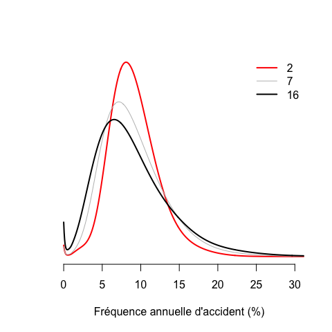

``` r
plot(vx*100,vy3,col=COLORS[2],lwd=2,type="l",xlim=c(0,30),
     xlab="Fréquence annuelle d'accident (%)",ylab="",axes=FALSE)
axis(1)
legend("topright",bty="n",c("2 variables explicatives","7","16"),
       col=c(COLORS[2],"grey","black"),lwd=c(2,1,2))
lines(100*vx,vy9,col="grey")
lines(100*vx,vy16,lwd=2)
```

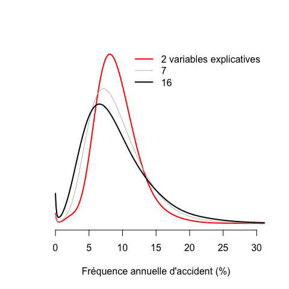

``` r
idx = which(vx>.17)

plot(vx*100,vy3,col=COLORS[2],lwd=2,type="l",xlim=c(0,30),
     xlab="Fréquence annuelle d'accident (%)",ylab="",axes=FALSE)
axis(1)
legend("topright",bty="n",c("2 variables explicatives","7","16"),
       col=c(COLORS[2],"grey","black"),lwd=c(2,1,2))
polygon(c(vx[idx],.17)*100,c(vy3[idx],0),border=NA,col=COLORS[2],density=25)
polygon(c(vx[idx],.17)*100,c(vy16[idx],0),border=NA,col="black",density=15)
lines(100*vx,vy9,col="grey")
lines(100*vx,vy16,lwd=2)
text(17,max(vy16[idx]),"    0.8%",col=COLORS[2],pos=3)
text(20,max(vy16[idx])-1,"    5.6%",col="black",pos=3)
```

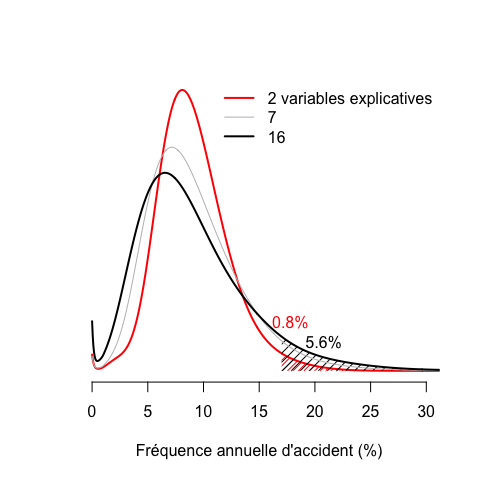

# random forest

<!-- ```{r} -->
<!-- RF = randomForest(y~. ,data=frenchmotor) -->
<!-- varImpPlot(RF , sort = TRUE) -> vi -->
<!-- dfvi = data.frame(nom = names(frenchmotor)[-16], g = as.numeric(vi)) -->
<!-- dfvi = dfvi[rev(order(dfvi$g)),] -->
<!-- nom = dfvi$nom -->
<!-- nom[1] = "bs(LicAge)" -->
<!-- nom[3] = "bs(DrivAge)" -->
<!-- nom[7] = "bs(BonusMalus)" -->
<!-- n=nrow(frenchmotor) -->
<!-- library(splines) -->
<!-- frenchmotorbruit = frenchmotor -->
<!-- frenchmotorbruit$y = (frenchmotorbruit$y=="1")+rbeta(n,1,9)/1000 -->
<!-- metric= function(k =3){ -->
<!--   sortie=c(0,0,1,1,1,1,1,1,0) -->
<!--   if(k>0){ -->
<!-- varj = which(names(frenchmotorbruit) %in% c("y",dfvi$nom[1:k])) -->
<!-- frenchmotorbruit2 = frenchmotorbruit[,varj] -->
<!-- reg = randomForest(y~., data=frenchmotorbruit2) -->
<!-- yp = predict(reg)-1/10000 -->
<!-- v1 = var(yp) -->
<!-- idx9 = which(yp>quantile(yp,.9)) -->
<!-- idx1 = which(yp<quantile(yp,.1)) -->
<!-- v2 = var(yp[idx9]) -->
<!-- m1 = mean(yp[idx9])/mean(yp) -->
<!-- m2 = mean(yp[idx9])/mean(yp[idx1]) -->
<!-- q1 = quantile(yp,.9)-quantile(yp,.1) -->
<!-- q2 = quantile(yp,.9)/quantile(yp,.1) -->
<!-- q3 = quantile(yp,.9)/mean(yp) -->
<!-- q4 = quantile(yp,.99)/mean(yp) -->
<!-- z = mean(yp>2*mean(yp)) -->
<!-- sortie = c(v1,v2,m1,m2,q1,q2,q3,q4,z) -->
<!--   } -->
<!--   sortie} -->
<!-- N = 0:16 -->
<!-- M2 =Vectorize(metric)(N) -->
<!-- ``` -->
<!-- ```{r, fig.height = 5, fig.width = 5, fig.align = "center",warning = FALSE} -->
<!-- plot(N,M2[1,],xlab="Nombre de variables explicatives",ylab= -->
<!--        "Variance des primes",type="b",pch=19,col=COLORS[1]) -->
<!-- lines(N,M[1,],col=COLORS[1]) -->
<!-- plot(N,M2[3,],xlab="Nombre de variables explicatives",ylab= -->
<!--        "Espérance du top 10% / Espérance globale",type="b",pch=19,col=COLORS[2]) -->
<!-- plot(N,M2[4,],xlab="Nombre de variables explicatives",ylab= -->
<!--        "Espérance du top 10% / Espérance du bottom 10%",type="b",pch=19,col=COLORS[3]) -->
<!-- lines(N,M[4,],col=COLORS[3]) -->
<!-- plot(N,M2[5,],xlab="Nombre de variables explicatives",ylab= -->
<!--        "Différence Q90%-Q10%",type="b",pch=19,col=COLORS[4]) -->
<!-- library(kdensity) -->
<!-- plot(N,M2[6,],xlab="Nombre de variables explicatives",ylab= -->
<!--        "Ratio des quantiles Q90% / Q10%",type="b",pch=19,col=COLORS[4]) -->
<!-- lines(N,M[6,],col=COLORS[4]) -->
<!-- plot(N,M2[8,],xlab="Nombre de variables explicatives",ylab= -->
<!--        "Ratio Q99% / moyenne",type="b",pch=19,col=COLORS[4]) -->
<!-- lines(N,M[8,],col=COLORS[4]) -->
<!-- plot(N,M2[9,],xlab="Nombre de variables explicatives",ylab= -->
<!--        "Proba >17%",type="b",pch=19,col=COLORS[4]) -->
<!-- lines(N,M[9,],col=COLORS[4]) -->
<!-- M2[9,]*100 -->
<!-- ``` -->
<!-- ```{r, fig.height = 5, fig.width = 5, fig.align = "center",warning = FALSE} -->
<!-- k=2 -->
<!-- varj = which(names(frenchmotorbruit) %in% c("y",dfvi$nom[1:k])) -->
<!-- frenchmotorbruit2 = frenchmotorbruit[,varj] -->
<!-- reg = randomForest(y~., data=frenchmotorbruit2) -->
<!-- yp = predict(reg)-1/10000 -->
<!-- idx = which((yp>0)&(yp<1)) -->
<!-- yp = sample(yp[idx],size=1000) -->
<!-- d32 = kdensity::kdensity(yp, kernel = "beta") -->
<!-- ``` -->
<!-- ```{r, fig.height = 5, fig.width = 5, fig.align = "center",warning = FALSE} -->
<!-- k=7 -->
<!-- varj = which(names(frenchmotorbruit) %in% c("y",dfvi$nom[1:k])) -->
<!-- frenchmotorbruit2 = frenchmotorbruit[,varj] -->
<!-- reg = randomForest(y~., data=frenchmotorbruit2) -->
<!-- yp = predict(reg)-1/10000 -->
<!-- idx = which((yp>0)&(yp<1)) -->
<!-- yp = sample(yp[idx],size=1000) -->
<!-- d92 = kdensity::kdensity(yp, kernel = "beta") -->
<!-- ``` -->
<!-- ```{r, fig.height = 5, fig.width = 5, fig.align = "center",warning = FALSE} -->
<!-- k=16 -->
<!-- varj = which(names(frenchmotorbruit) %in% c("y",dfvi$nom[1:k])) -->
<!-- frenchmotorbruit2 = frenchmotorbruit[,varj] -->
<!-- reg = randomForest(y~., data=frenchmotorbruit2) -->
<!-- yp = predict(reg)-1/10000 -->
<!-- idx = which((yp>0)&(yp<1)) -->
<!-- yp = sample(yp[idx],size=1000) -->
<!-- d162 = kdensity::kdensity(yp, kernel = "beta") -->
<!-- ``` -->
<!-- ```{r, fig.height = 5, fig.width = 5, fig.align = "center",warning = FALSE} -->
<!-- vx =seq(0,.4,length=251) -->
<!-- vy32= d32(vx) -->
<!-- vy92= d92(vx) -->
<!-- vy162=d162(vx) -->
<!-- plot(vx*100,vy32,col=COLORS[3],lwd=2,type="l",xlim=c(0,30), -->
<!--      xlab="Fréquence d'accident (%)",ylab="",axes=FALSE,ylim=c(0,max(vy3))) -->
<!-- axis(1) -->
<!-- legend("topright",bty="n",c("3","7","16"), -->
<!--        col=c(COLORS[c(3,4)],"black"),lwd=c(2,1,2)) -->
<!-- lines(100*vx,vy92,col=COLORS[4]) -->
<!-- lines(100*vx,vy162,lwd=2) -->
<!-- ``` -->
