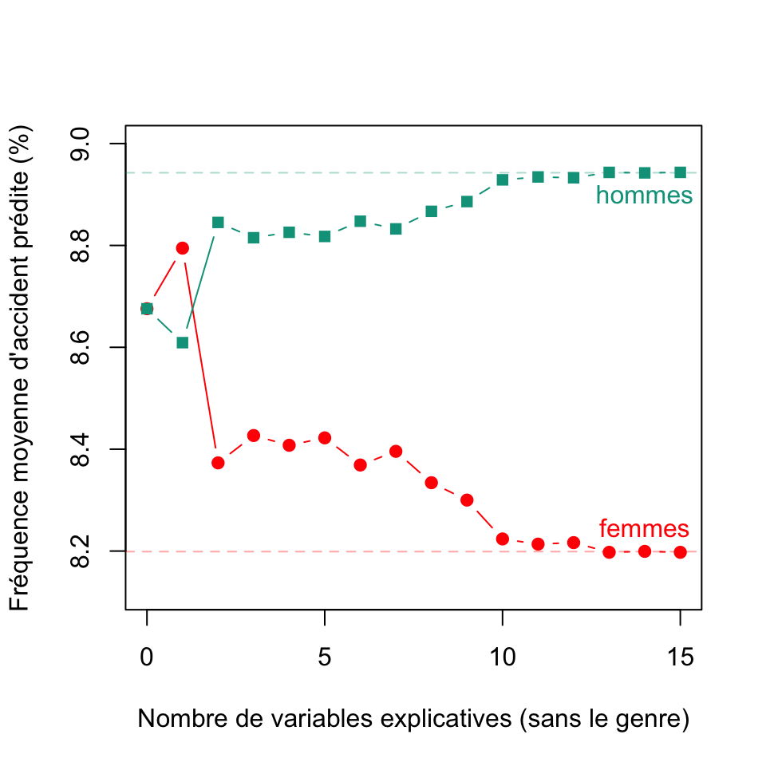
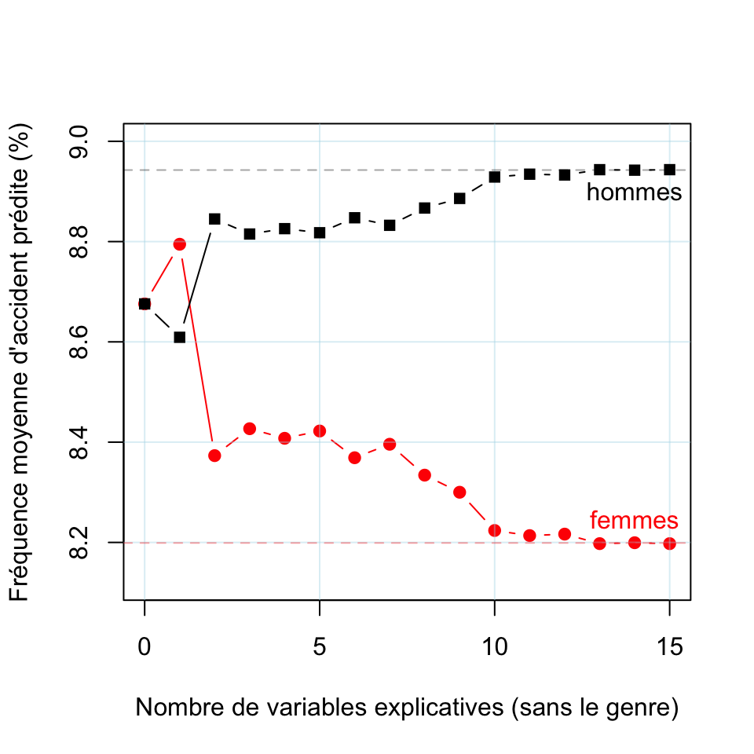
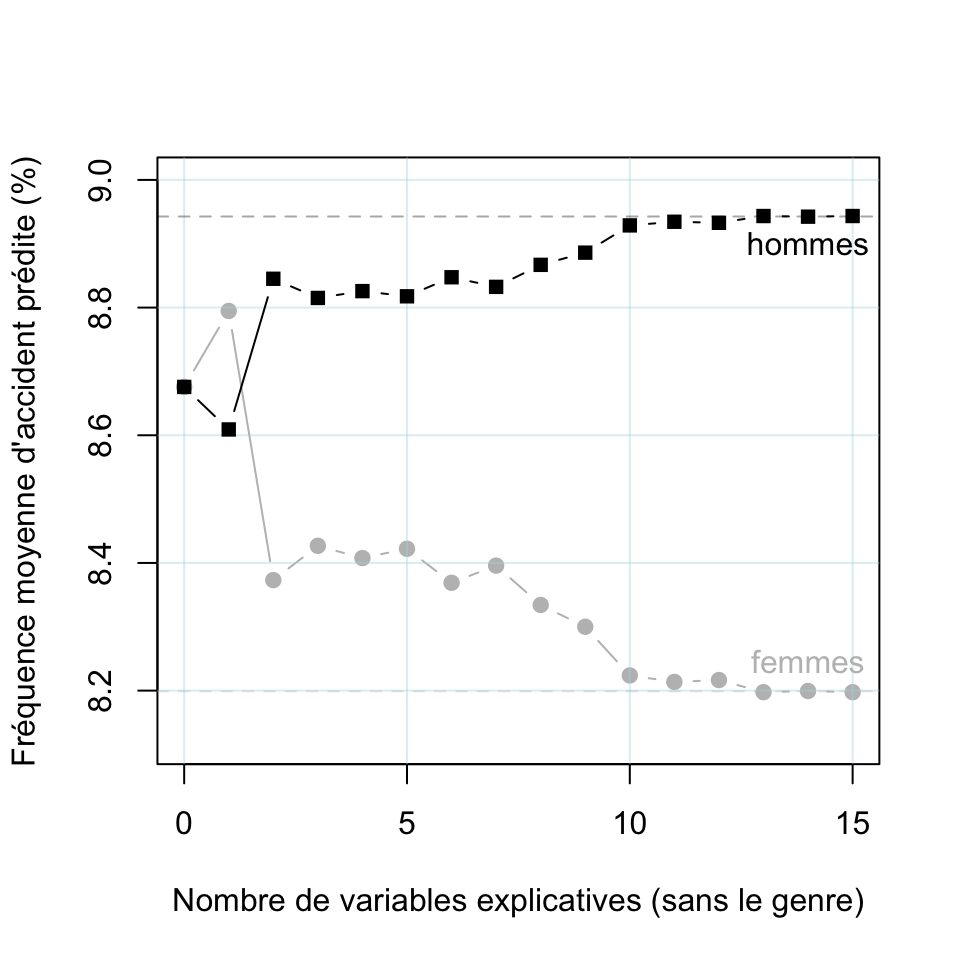

# FIDA

``` r
library(InsurFair)
library(randomForest)
```

    randomForest 4.7-1.1

    Type rfNews() to see new features/changes/bug fixes.

``` r
data(frenchmotor)
data(COLORS)
```

# Régression logistique (avec lissage ou pas)

``` r
RF = randomForest(y~. ,data=frenchmotor)
varImpPlot(RF , sort = TRUE) -> vi
```


``` r
dfvi = data.frame(nom = names(frenchmotor)[-16], g = as.numeric(vi))
dfvi = dfvi[rev(order(dfvi$g)),]
nom = dfvi$nom
nom[1] = "bs(LicAge)"
nom[3] = "bs(DrivAge)"
nom[7] = "bs(BonusMalus)"


n=nrow(frenchmotor)
library(splines)

metricbs= function(k =3){
  sortie=c(0,0,1,1,1,1,1,1,0,1)
  if(k>0){
vr = paste(nom[1:k],collapse = " + ")
fm = paste("y ~ ",vr,sep="")
reg = glm(fm, family=binomial, data=frenchmotor)
yp = predict(reg, type="response")
v1 = var(yp)
idx9 = which(yp>quantile(yp,.9))
idx1 = which(yp<quantile(yp,.1))
v2 = var(yp[idx9])
m1 = mean(yp[idx9])/mean(yp)
m2 = mean(yp[idx9])/mean(yp[idx1])
q1 = quantile(yp,.9)-quantile(yp,.1)
q2 = quantile(yp,.9)/quantile(yp,.1)
q3 = quantile(yp,.9)/mean(yp)
q4 = quantile(yp,.99)/mean(yp)
z = mean(yp>2*mean(yp))
idx95 = which(yp>quantile(yp,.95))
idx05 = which(yp<quantile(yp,.05))
sortie = c(v1,v2,m1,m2,q1,q2,q3,q4,z, mean(yp[idx95])/mean(yp[idx05]))
  }
  sortie}

metric= function(k =3){
  sortie=c(0,0,1,1,1,1,1,1,0,1)
  if(k>0){
vr = paste(dfvi$nom[1:k],collapse = " + ")
fm = paste("y ~ ",vr,sep="")
reg = glm(fm, family=binomial, data=frenchmotor)
yp = predict(reg, type="response")
v1 = var(yp)
idx9 = which(yp>quantile(yp,.9))
idx1 = which(yp<quantile(yp,.1))
idx95 = which(yp>quantile(yp,.95))
idx05 = which(yp<quantile(yp,.05))
v2 = var(yp[idx9])
m1 = mean(yp[idx9])/mean(yp)
m2 = mean(yp[idx9])/mean(yp[idx1])
q1 = quantile(yp,.9)-quantile(yp,.1)
q2 = quantile(yp,.9)/quantile(yp,.1)
q3 = quantile(yp,.9)/mean(yp)
q4 = quantile(yp,.99)/mean(yp)
z = mean(yp>2*mean(yp))
sortie = c(v1,v2,m1,m2,q1,q2,q3,q4,z,mean(yp[idx95])/mean(yp[idx05]))
  }
  sortie}

N = 0:16
M0 =Vectorize(metric)(N)
M =Vectorize(metricbs)(N)
```

``` r
plot(N,M[1,],xlab="Nombre de variables explicatives",ylab=
       "Variance des scores",type="b",pch=19,col=COLORS[2])
```


``` r
plot(N,M[1,],xlab="Nombre de variables explicatives",ylab=
       "Variance des scores",type="b",pch=19)

plot(N,M[1,],xlab="Nombre de variables explicatives",ylab=
       "Variance des scores",type="b",pch=19)
lines(N,M0[1,],type="b",pch=15, col=scales::alpha("grey",.6))
```


``` r
plot(N,M[1,],xlab="Nombre de variables explicatives",ylab=
       "Variance des scores",type="b",pch=19)
lines(N,M0[1,],type="b",pch=15, col=scales::alpha("grey",.6))
abline(v=(0:3)*5,col=scales::alpha("light blue",.4))
abline(h=(0:5)/5*.0025,col=scales::alpha("light blue",.4))
```


``` r
plot(N,M[1,],xlab="Nombre de variables explicatives",ylab=
       "Variance des scores",type="b",pch=19)
lines(N,M0[1,],type="b",pch=15, col=scales::alpha("grey",.8))
abline(v=(0:3)*5,col=scales::alpha("light blue",.4))
abline(h=(0:5)/5*.0025,col=scales::alpha("light blue",.4))
```


``` r
# plot(N,M[3,],xlab="Nombre de variables explicatives",ylab=
#        "Espérance du top 10% / Espérance globale",type="b",pch=19,col=COLORS[2])
```

``` r
plot(N,M[4,],xlab="Nombre de variables explicatives",ylab=
       "Ratio des espérances du décile 90% / 10%",type="b",pch=19,col=COLORS[2])
```


``` r
plot(N,M[4,],xlab="Nombre de variables explicatives",ylab=
       "Ratio des espérances du décile 90% / 10%",type="b",pch=19)

plot(N,M[4,],xlab="Nombre de variables explicatives",ylab=
       "Ratio des espérances du décile 90% / 10%",type="b",pch=19)
lines(N,M0[4,],type="b",pch=15, col=scales::alpha("grey",.6))
```


``` r
plot(N,M[4,],xlab="Nombre de variables explicatives",ylab=
       "Ratio des espérances du décile 90% / 10%",type="b",pch=19)
lines(N,M0[4,],type="b",pch=15, col=scales::alpha("grey",.6))
abline(v=(0:3)*5,col=scales::alpha("light blue",.4))
abline(h=(0:8),col=scales::alpha("light blue",.4))
```


``` r
plot(N,M[4,],xlab="Nombre de variables explicatives",ylab=
       "Ratio des espérances du décile 90% / 10%",type="b",pch=19)
lines(N,M0[4,],type="b",pch=15, col=scales::alpha("grey",.8))
abline(v=(0:3)*5,col=scales::alpha("light blue",.4))
abline(h=(0:8),col=scales::alpha("light blue",.4))
```


``` r
plot(N,M[6,],xlab="Nombre de variables explicatives",ylab=
       "Ratio des quantiles 90% / 10%",type="b",pch=19,col=COLORS[2])
```


``` r
plot(N,M[6,],xlab="Nombre de variables explicatives",ylab=
       "Ratio des quantiles 90% / 10%",type="b",pch=19)

plot(N,M[6,],xlab="Nombre de variables explicatives",ylab=
       "Ratio des quantiles 90% / 10%",type="b",pch=19)
lines(N,M0[6,],type="b",pch=15, col=scales::alpha("grey",.6))
```


``` r
plot(N,M[6,],xlab="Nombre de variables explicatives",ylab=
       "Ratio des quantiles 90% / 10%",type="b",pch=19)
lines(N,M0[6,],type="b",pch=15, col=scales::alpha("grey",.6))
abline(v=(0:3)*5,col=scales::alpha("light blue",.4))
abline(h=(0:8)/2,col=scales::alpha("light blue",.4))
```


``` r
plot(N,M[6,],xlab="Nombre de variables explicatives",ylab=
       "Ratio des quantiles 90% / 10%",type="b",pch=19)
lines(N,M0[6,],type="b",pch=15, col=scales::alpha("grey",.8))
abline(v=(0:3)*5,col=scales::alpha("light blue",.4))
abline(h=(0:8)/2,col=scales::alpha("light blue",.4))
```


``` r
# plot(N,M[5,],xlab="Nombre de variables explicatives",ylab=
#        "Différence Q90%-Q10%",type="b",pch=19,col=COLORS[4])
library(kdensity)
# plot(N,M[6,],xlab="Nombre de variables explicatives",ylab=
#        "Ratio du quantile 90% / 10%",type="b",pch=19,col=COLORS[4])
# plot(N,M[8,],xlab="Nombre de variables explicatives",ylab=
#        "Ratio Q99% / moyenne",type="b",pch=19,col=COLORS[4])
plot(N,M[9,],xlab="Nombre de variables explicatives",ylab=
       "Proba >17%",type="b",pch=19,col=COLORS[2])
```


``` r
k=2
vr = paste(nom[1:k],collapse = " + ")
fm = paste("y ~ ",vr,sep="")
reg = glm(fm, family=binomial, data=frenchmotor)
yp = predict(reg, type="response")
mean(yp>.17)
```

    [1] 0.008683766

``` r
yp = sample(yp,size=5000)
d3 = kdensity::kdensity(yp, kernel = "beta",bw=.005)

k=7
vr = paste(nom[1:k],collapse = " + ")
fm = paste("y ~ ",vr,sep="")
reg = glm(fm, family=binomial, data=frenchmotor)
yp = predict(reg, type="response")
yp = sample(yp,size=5000)
d9 = kdensity::kdensity(yp, kernel = "beta",bw=.005)

k=16
vr = paste(nom[1:k],collapse = " + ")
fm = paste("y ~ ",vr,sep="")
reg = glm(fm, family=binomial, data=frenchmotor)
yp = predict(reg, type="response")
mean(yp>.17)
```

    [1] 0.05628367

``` r
yp = sample(yp,size=5000)

d16 = kdensity::kdensity(yp, kernel = "beta",bw=.005)

vx =seq(0,.35,length=601)
vy3= d3(vx)
vy9= d9(vx)
vy16=d16(vx)
```

``` r
plot(vx*100,vy3,col=COLORS[2],lwd=2,type="l",xlim=c(0,30),
     xlab="Fréquence annuelle d'accident (%)",ylab="",axes=FALSE)
axis(1)
legend("topright",bty="n",c("2","7","16"),
       col=c(COLORS[2],"grey","black"),lwd=c(2,1,2))
lines(100*vx,vy9,col="grey")
lines(100*vx,vy16,lwd=2)
```


``` r
plot(vx*100,vy3,col=COLORS[2],lwd=2,type="l",xlim=c(0,30),
     xlab="Fréquence annuelle d'accident (%)",ylab="",axes=FALSE)
axis(1)
legend("topright",bty="n",c("2 variables explicatives","7","16"),
       col=c(COLORS[2],"grey","black"),lwd=c(2,1,2))
lines(100*vx,vy9,col="grey")
lines(100*vx,vy16,lwd=2)
```


``` r
idx = which(vx>.17)

plot(vx*100,vy3,col=COLORS[2],lwd=2,type="l",xlim=c(0,30),
     xlab="Fréquence annuelle d'accident (%)",ylab="",axes=FALSE)
axis(1)
legend("topright",bty="n",c("2 variables explicatives","7","16"),
       col=c(COLORS[2],"grey","black"),lwd=c(2,1,2))
polygon(c(vx[idx],.17)*100,c(vy3[idx],0),border=NA,col=COLORS[2],density=25)
polygon(c(vx[idx],.17)*100,c(vy16[idx],0),border=NA,col="black",density=15)
lines(100*vx,vy9,col="grey")
lines(100*vx,vy16,lwd=2)
text(17,max(vy16[idx]),"    0.8%",col=COLORS[2],pos=3)
text(20,max(vy16[idx])-1,"    5.6%",col="black",pos=3)
```


# genre

``` r
library(randomForest)
subfrenchmotor= frenchmotor[,-which(names(frenchmotor)=="sensitive")]
RF = randomForest(y~. ,data=subfrenchmotor)
varImpPlot(RF , sort = TRUE) -> vi
```


``` r
dfvi = data.frame(nom = names(subfrenchmotor)[-15], g = as.numeric(vi))
dfvi = dfvi[rev(order(dfvi$g)),]
nom = dfvi$nom
nom[1] = "bs(LicAge)"
nom[3] = "bs(DrivAge)"
nom[7] = "bs(BonusMalus)"

n=nrow(subfrenchmotor)
library(splines)

idx_F =which(frenchmotor$sensitive == "Female")
idx_M =which(frenchmotor$sensitive == "Male")

metric_gender= function(k =3){
  if(k==0){
reg = glm(y~1, family=binomial, data=subfrenchmotor)
yp = predict(reg, type="response")
yp_F = yp[idx_F]
yp_M = yp[idx_M]
sortie = c(mean(yp_F),mean(yp_M),quantile(yp_F,c(.1,.9)),quantile(yp_M,c(.1,.9)))
names(sortie)[1:2]=c("mean_F","mean_M")
  }
  if(k>0){
vr = paste(nom[1:k],collapse = " + ")
fm = paste("y ~ ",vr,sep="")
reg = glm(fm, family=binomial, data=subfrenchmotor)
yp = predict(reg, type="response")
yp_F = yp[idx_F]
yp_M = yp[idx_M]
sortie = c(mean(yp_F),mean(yp_M),quantile(yp_F,c(.1,.9)),quantile(yp_M,c(.1,.9)))
names(sortie)[1:2]=c("mean_F","mean_M")
  }
sortie}

N = 0:15
M =Vectorize(metric_gender)(N)
```

``` r
plot(N,M[1,]*100,xlab="Nombre de variables explicatives (sans le genre)",ylab=
       "Fréquence moyenne d'accident prédite (%)",type="b",pch=19,col=COLORS[2],ylim=c(8.12,9))
lines(N,M[2,]*100,type="b",pch=15,col=COLORS[3])
abline(h=mean(frenchmotor[idx_F,"y"]=="1")*100,col=scales::alpha(COLORS[2],.35),lty=2)
abline(h=mean(frenchmotor[idx_M,"y"]=="1")*100,col=scales::alpha(COLORS[3],.35),lty=2)
text(14,mean(frenchmotor[idx_F,"y"]=="1")*100,"femmes",col=COLORS[2],pos=3)
text(14,mean(frenchmotor[idx_M,"y"]=="1")*100,"hommes",col=COLORS[3],pos=1)
```



``` r
plot(N,M[1,]*100,xlab="Nombre de variables explicatives (sans le genre)",ylab=
       "Fréquence moyenne d'accident prédite (%)",type="b",pch=19,col=COLORS[2],ylim=c(8.12,9))
abline(v=(0:3)*5,col=scales::alpha("light blue",.4))
abline(h=seq(8,9.2,by=.2),col=scales::alpha("light blue",.4))
lines(N,M[2,]*100,type="b",pch=15,col=COLORS[3])
abline(h=mean(frenchmotor[idx_F,"y"]=="1")*100,col=scales::alpha(COLORS[2],.35),lty=2)
abline(h=mean(frenchmotor[idx_M,"y"]=="1")*100,col=scales::alpha(COLORS[3],.35),lty=2)
text(14,mean(frenchmotor[idx_F,"y"]=="1")*100,"femmes",col=COLORS[2],pos=3)
text(14,mean(frenchmotor[idx_M,"y"]=="1")*100,"hommes",col=COLORS[3],pos=1)
```


``` r
plot(N,M[1,]*100,xlab="Nombre de variables explicatives (sans le genre)",ylab=
       "Fréquence moyenne d'accident prédite (%)",type="b",pch=19,col=COLORS[2],ylim=c(8.12,9))
abline(v=(0:3)*5,col=scales::alpha("light blue",.4))
abline(h=seq(8,9.2,by=.2),col=scales::alpha("light blue",.4))
lines(N,M[2,]*100,type="b",pch=15,col="black")
abline(h=mean(frenchmotor[idx_F,"y"]=="1")*100,col=scales::alpha(COLORS[2],.35),lty=2)
abline(h=mean(frenchmotor[idx_M,"y"]=="1")*100,col=scales::alpha("black",.35),lty=2)
text(14,mean(frenchmotor[idx_F,"y"]=="1")*100,"femmes",col=COLORS[2],pos=3)
text(14,mean(frenchmotor[idx_M,"y"]=="1")*100,"hommes",col="black",pos=1)
```



``` r
plot(N,M[1,]*100,xlab="Nombre de variables explicatives (sans le genre)",ylab=
       "Fréquence moyenne d'accident prédite (%)",type="b",pch=19,col="grey",ylim=c(8.12,9))
abline(v=(0:3)*5,col=scales::alpha("light blue",.4))
abline(h=seq(8,9.2,by=.2),col=scales::alpha("light blue",.4))
lines(N,M[2,]*100,type="b",pch=15,col="black")
abline(h=mean(frenchmotor[idx_F,"y"]=="1")*100,col=scales::alpha("grey",.35),lty=2)
abline(h=mean(frenchmotor[idx_M,"y"]=="1")*100,col=scales::alpha("black",.35),lty=2)
text(14,mean(frenchmotor[idx_F,"y"]=="1")*100,"femmes",col="grey",pos=3)
text(14,mean(frenchmotor[idx_M,"y"]=="1")*100,"hommes",col="black",pos=1)
```


